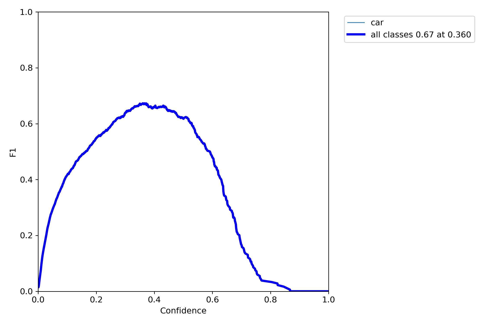
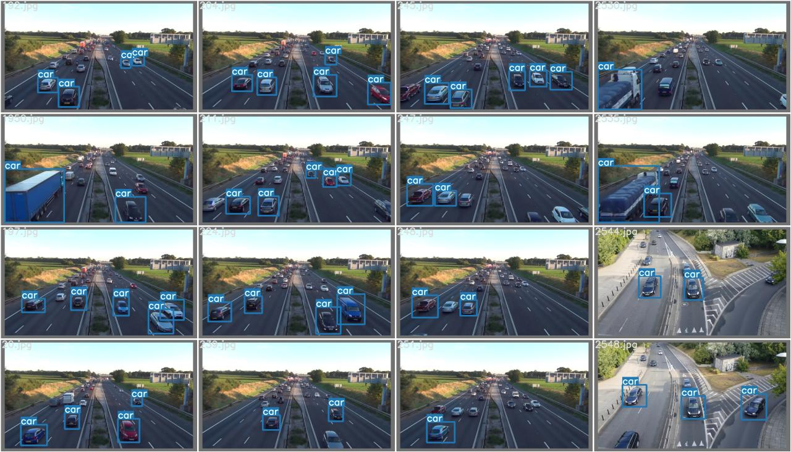
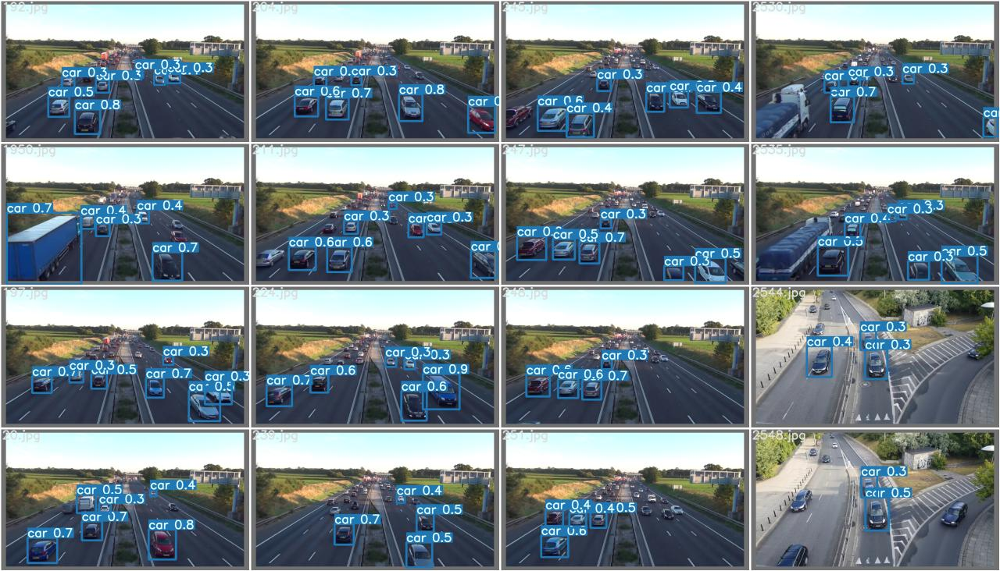

# YOLOv7-Mod for Vehicle Detection

This repository contains an experimental modification of **YOLOv7** based on the paper *"Object Detection in Dense and Mixed Traffic for Autonomous Vehicles with Modified YOLO"*.  
The goal is to improve detection of **small and partially occluded vehicles** compared to the baseline YOLOv7.

---

## 🚀 Setup

```bash
# Install PyTorch with CUDA 12.4
pip install torch torchvision torchaudio --index-url https://download.pytorch.org/whl/cu124

# Verify GPU
python -c "import torch; print(torch.cuda.is_available())"

# Install dependencies
pip install matplotlib opencv-python Pillow PyYAML requests scipy tqdm tensorboard pandas seaborn ipython psutil thop
```

## 📂 Dataset

- Source: [Kaggle – Vehicle Detection (YOLO version)](https://www.kaggle.com/datasets/muhammadhananasghar/vehicle-detectionyolo-version)  
- An **800-image subset** was created using a random sampling script.  
- Split: **640 training images** / **160 validation images**  
- Classes: **1 (`car`)**

---

## 🏋️ Training

- Model initialized with **pretrained YOLOv7 weights (`yolov7.pt`)**  
- Trained for approximately **100 epochs** on the custom dataset  
- Both the **baseline YOLOv7** and the **modified YOLOv7** were trained under the same settings for fair comparison


## 📊 Results

- Trained on a custom subset of **800 images** (640 train / 160 val).  
- Training completed for ~100 epochs total.  
- **F1 Score**: **0.67** at confidence threshold **0.36**.  
- **Confusion Matrix**: ~71% accuracy for car detection.  
- Validation results show the model often detects **more cars than ground-truth labels**, indicating improved sensitivity to **small and partially occluded vehicles**.

### Visualizations

📈 **F1 Score Curve**  


🖼️ **Example Validation Batches**  
- Ground Truth  
    

- Predictions  
  


## ✅ Conclusion

- The dataset labels are **incomplete**, with many cars (especially small or partially visible ones) missing from annotations.  
- The **modified YOLOv7 model** was able to correctly predict more cars than those present in the ground-truth labels, showing improved sensitivity.  
- With **larger and better-labeled datasets**, and by training for more epochs, the model can further improve in detecting cars in traffic, including **partially visible and small vehicles**.

**Key takeaways:**
- Detects more vehicles in crowded and occluded scenes than baseline.  
- Achieved an **F1 score of 0.67** at confidence threshold **0.36**.  
- Confusion matrix shows ~71% accuracy for car detection.  
- Prediction results (`test_batch_pred.jpg`) often show more cars detected than the ground-truth labels (`test_batch_labels.jpg`), highlighting improved sensitivity.

**Future work:**
- Train on larger, occlusion-heavy datasets (e.g., **UA-DETRAC**, **BDD100K**).  
- Tune anchors and hyperparameters for better small-object detection.  
- Evaluate across diverse **weather** and **lighting conditions** for real-world robustness.  
